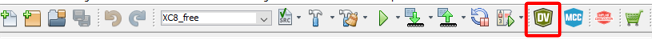
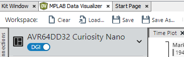
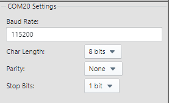
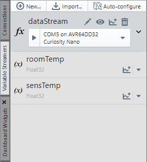
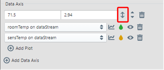
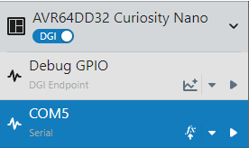
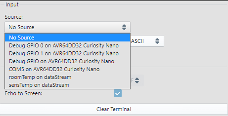
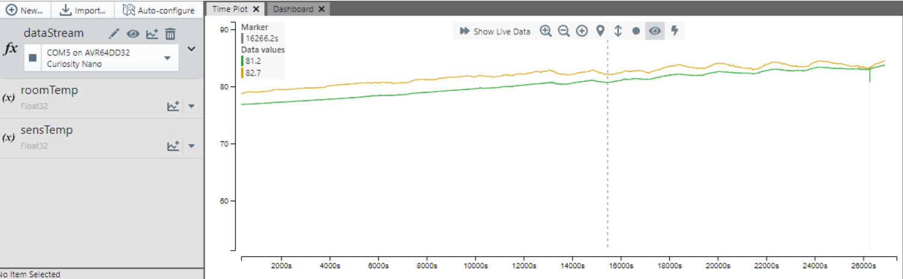

<!-- Please do not change this logo with link -->

# Room Temperature Monitor with AVR&reg; DD and MLX90632

This virtual kit creates a simple room temperature monitor using the AVR&reg; DD microcontroller to communicate with an MLX90632 Far InfraRed (FIR) sensor to measure the temperature of an object (which is assumed to represent the room's temperature). Communication with the MLX90632 is over I2C and data is sent to the computer over UART. Measurements from this demo can be read in plaintext on a serial terminal, or can be plotted over time in MPLAB&reg; Data Visualizer.

This demo was co-developed with Melexis

## Related Documentation

- [MLX90632 Sensor Homepage](https://www.melexis.com/en/product/MLX90632/Miniature-SMD-Infrared-Thermometer-IC)
- [AVR64DD32 Product Page](https://www.microchip.com/en-us/product/AVR64DD32?utm_source=GitHub&utm_medium=TextLink&utm_campaign=MCU8_MMTCha_avrdd&utm_content=avrdd-room-temp-sensor-mplab-mcc-github)

## Software Used

- [MPLAB X IDE v6.00 or newer](https://www.microchip.com/en-us/tools-resources/develop/mplab-x-ide?utm_source=GitHub&utm_medium=TextLink&utm_campaign=MCU8_MMTCha_avrdd&utm_content=avrdd-room-temp-sensor-mplab-mcc-github)
- [MPLAB XC8 v2.36 or newer](https://www.microchip.com/en-us/tools-resources/develop/mplab-xc-compilers?utm_source=GitHub&utm_medium=TextLink&utm_campaign=MCU8_MMTCha_avrdd&utm_content=avrdd-room-temp-sensor-mplab-mcc-github)
- [MPLAB Data Visualizer](https://www.microchip.com/en-us/tools-resources/debug/mplab-data-visualizer?utm_source=GitHub&utm_medium=TextLink&utm_campaign=MCU8_MMTCha_avrdd&utm_content=avrdd-room-temp-sensor-mplab-mcc-github)

## Hardware Used

- [AVR64DD32 Curiosity Nano (EV72Y42A)](https://www.microchip.com/en-us/development-tool/EV72Y42A?utm_source=GitHub&utm_medium=TextLink&utm_campaign=MCU8_MMTCha_avrdd&utm_content=avrdd-room-temp-sensor-mplab-mcc-github)
- [Curiosity Nano Base for Click&trade; (AC164162)](https://www.microchip.com/en-us/development-tool/AC164162?utm_source=GitHub&utm_medium=TextLink&utm_campaign=MCU8_MMTCha_avrdd&utm_content=avrdd-room-temp-sensor-mplab-mcc-github)
- [IR Thermo 3 Click by MikroE](https://www.mikroe.com/ir-thermo-3-click)

## Setup

### Hardware Setup

Connect the IR Thermo 3 Click to any of the slots on the Curiosity Nano Base Board. Operating voltage was set at 3.3V.

### I/O Usage

| I/O Pin | Description
| ------- | ----------
| PA2 | I2C SDA
| PA3 | I2C SCL
| PB0 | UART TX
| PB1 | UART RX (unused, but reserved)
| PB2 | SW0 - Safe Mode Button
| PD3 | On-Board LED (changes states when results are ready)

### Data Visualizer Setup

1. Open MPLAB Data Visualizer. If installed, the MPLAB Data Visualizer icon should be in the top toolbar of MPLAB X IDE.

2. Load the MPLAB Data Visualizer Configuration.

3. The COM port for the Curiosity Nano should be set as the following:

- Baud Rate: 115200
- Char Length: 8 bits
- Parity: None
- Stop Bits: 1 bit

#### Graphing Mode Setup

3. Click on the "Variable Streamers" tab on the left side of the tab and press the "Play" button.

4. Hover over any part of the graphing plot to see graph options. Press the "Show Live Data" button (>>).

5. Auto-range the graph axis. In the Data Axis box, click on the up-down arrow next the max/min values to enable automatic scaling.

#### Serial Terminal Setup

3. Press the "Play" button to open the COM port.

4. In the Serial Terminal tab, go to the right-side settings. In the source dropdown, select the COM port used by the Curiosity Nano.

### Output Modes

In this demo, there are 2 operating modes: a plaintext mode and a graphed data mode.

- In plaintext mode, the temperature measurements are printed in human-readable text, such as "Room Temperature: 74.1F".
- In graphed data mode, the temperature measurements are encoded for the Data Visualizer to plot out. These values are not directly human readable.

The operating mode is set by: `#define DV_FLOAT_OUT` in **tempMonitor.h**. If defined, the output will be encoded for plotting. If cleared, the output will be in plaintext.

### Temperature Units

This demo supports Fahrenheit, Celsius, or Kelvin units. Natively, the formula to calculate the sensor temperature is in Celsius, but the program can convert to another unit before it is printed out.

The temperature unit is set by `#define DEFAULT_TEMP_UNIT` in **tempMonitor.h**. The following are valid unit specifiers:

- 'C' = Celsius
- 'F' = Fahrenheit
- 'K' = Kelvin

Please note, the unit specifiers are *case sensitive*. If an invalid specifier is set, the program will default to Celsius.

## Theory of Operation

### Constant Caching

To improve startup speed, the constants read and pre-computed from the sensor are stored into the internal EEPROM of the microcontroller. During subsequent startups, the EEPROM is verified against the device ID of the sensor and the XOR of those bytes.

This feature can be bypassed by holding SW0 down when powering up the Curiosity Nano. To permanently disable constant caching, comment out `#define CACHE_CONSTANTS` in **MLX90632.h**.

### Main Loop

The main loop of this program is fairly simple. The microcontroller runs a state-machine that controls the sampling and data processing of the measurement data from the FIR sensor. If the data is ready to printed, then the microcontroller will also print the data to the UART. After performing these actions, the microcontroller will enter sleep until the Real Time Clock (RTC) wakes it up to repeat the cycle.

### FIR Sensor State Machine

There are 4 states in the FIR sensor state machine:  

- TEMP_START
- TEMP_WAIT
- TEMP_RESULTS
- TEMP_ERROR

In `TEMP_START`, the sensor is triggered to begin acquiring a new measurement. This state does **NOT** wait for the results to be ready. If the conversion was started successfully, then the state machine transitions to `TEMP_WAIT`. If an error occurs, then the state machine transitions to `TEMP_ERROR`.

In `TEMP_WAIT`, the sensor is polled to see if new results are ready. If they are not ready, the state machine remains in `TEMP_WAIT`. If results are ready, and no error occurs during data transfer, then the state machine transitions to `TEMP_RESULTS`. If an error occurs during result reading, then the state machine is moved to the `TEMP_ERROR` state.

In `TEMP_RESULTS`, the data received from the sensor is processed to get a temperature value. This step is the slowest state, as the calculation function is an iterative function with floating point operations and square roots.

In `TEMP_ERROR`, nothing will occur. If a program enters this state, a reset of the microcontroller is required. Depending on what triggered this state, a power cycle of the sensor may also be required. This state is usually triggered by an I2C communication failure.

## Calibration and Accuracy

This demo does not calibrate the temperature sensor. Depending on the specific environmental characteristics and temperatures in the field of view of the sensor, there will be an offset and some non-linear response.

## Summary

This example has shown how to use the AVR DD family of microcontrollers to implement a simple room temperature monitor.
